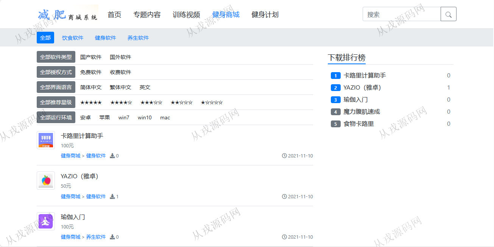

<h1 align="center">163.减肥商城管理系统</h1>

 获取sql文件 QQ: 386869957 QQ群: 377586148 

 [更多源码项目: 从戎源码网](https://armycodes.com/) 

## 简介

> 本代码来源于网络,仅供学习参考使用!
>
> 提供1.远程部署/2.修改代码/3.设计文档指导/4.框架代码讲解等服务
> 
> 前台访问地址：http://localhost:8080/
> 
> 管理后台访问: http://localhost:8080/cp/index.html#/login
> 
> 管理员：admin  123456
> 

## 项目介绍
基于springboot的减肥商城管理系统：前端 html、js，后端 maven、springmvc、spring、mybatis；角色分为管理员、教练、学员；集成健身专题内容，训练视频，健身商城等功能于一体的系统。

## 功能介绍

### 前台

- 网站首页：主导航栏，全局搜索，最新文章，热点新闻，精彩视频
- 专题内容：动作音乐，动作库，赞一下，踩一下
- 训练视频：分类导航，健身视频在线播放
- 健身商城：商品信息展示，商品详情，立即下载
- 健身计划：健身文章列表展示，健身文章在线阅读

### 管理后台

- 文章管理：文章的增删改查，标题图上传，内容支持富文本编辑，栏目设置，模版设置
- 栏目管理：栏目的增删改查，栏目支持上下级，栏目上移和下移，栏目置顶和置底
- 附件管理：附件查询和删除操作
- 用户管理：用户信息的增删改查，角色分配
- 角色管理；角色信息的增删改查

## 环境

- <b>IntelliJ IDEA 2021.3</b>

- <b>Mysql 5.7.26</b>

- <b>JDK 1.8</b>

## 运行截图

